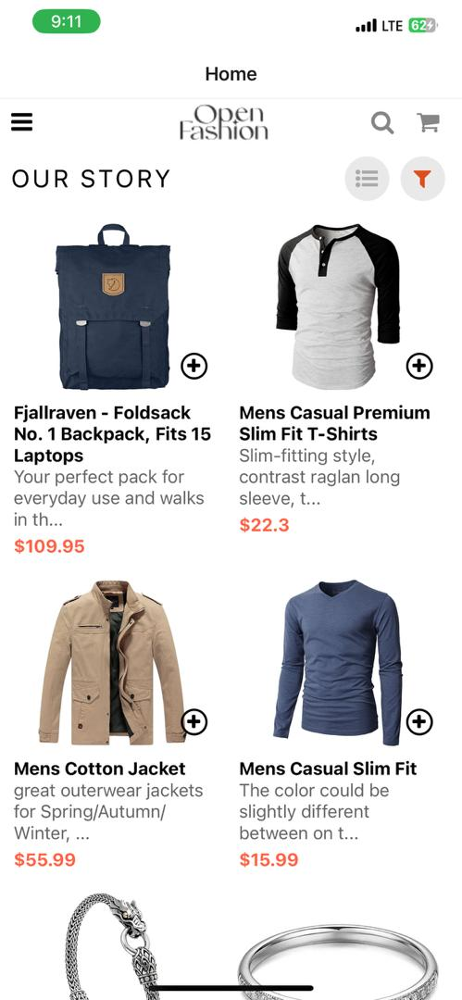
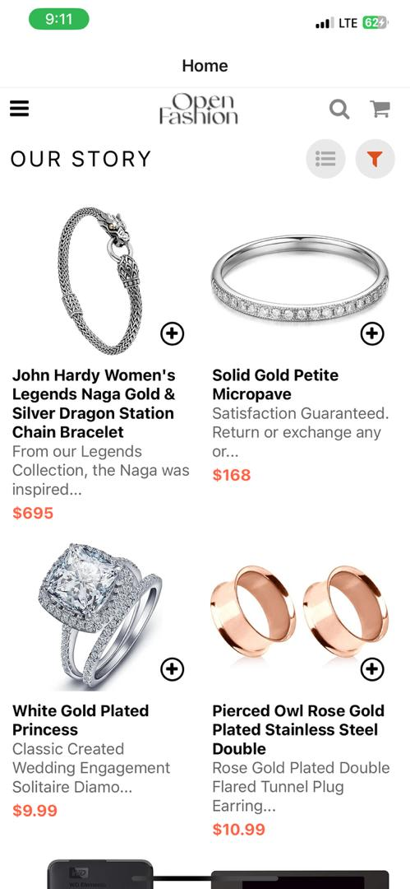
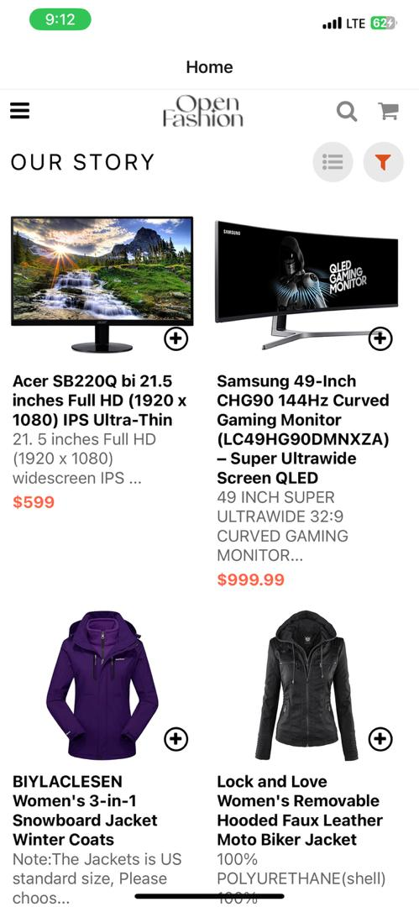
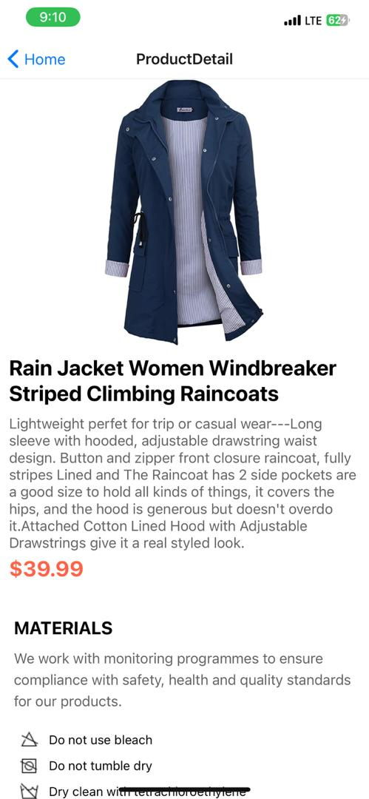
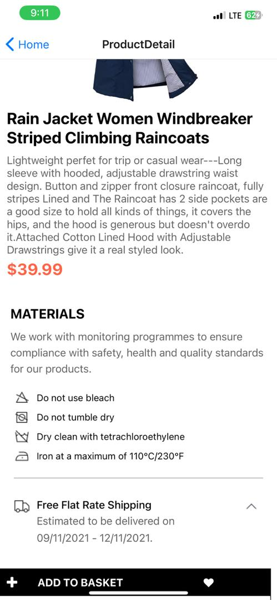

# React Native Shopping Application

## Overview

This project is a mobile application developed using React Native for shopping various products. It includes screens for browsing products, viewing product details, and managing a shopping cart.

## Screenshots

### Home Screen




### Product Detail Screen



### Cart Screen


## Features

- **Browse Products**: It allows user to view a list of products fetched from an external API.
- **Product Details**: It enables user to view detailed information about a product when taped.
- **Add to Cart**: It permits user to add products to the shopping cart.
- **Manage Cart**: It allows user to view and remove items from the cart.
- **Local Storage**: It uses AsyncStorage to store cart items locally on the device.

## Design Choices

- **Navigation**: Implemented with React Navigation, utilizing Drawer Navigator for main navigation and Stack Navigator for deeper navigation within sections.
  
- **State Management**: Managed using React Hooks (useState, useEffect) for local component state and asynchronous data fetching.

- **UI Components**: Utilized reusable components like TouchableOpacity, Image, and FlatList for efficient rendering and interaction.

## Data Storage

- **AsyncStorage**: Used AsyncStorage from `@react-native-async-storage/async-storage` to persist shopping cart items locally on the device.

## Getting Started

To run the project locally:

1. Clone the repository:
   ```bash
   git clone https://github.com/your-FranklinaAddae/your-repository.git
   cd your-repository
   ```

2. Install dependencies:

   ```bash
    npm install
   ```

3. Start the Metro Bundler:

   ```bash
    npm start
   ```

## Technologies Used:

- React Native
- AsyncStorage
- React Navigation
- Axios